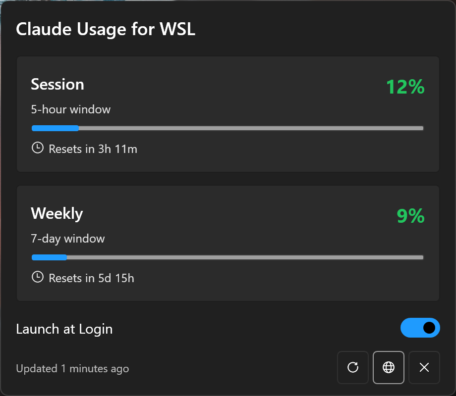

# Claude Usage for WSL

A Windows system tray application that displays Claude Code usage limits in real-time. Designed for users running Claude Code in WSL (Windows Subsystem for Linux).

## Features

- **System tray icon** with color-coded circle (green/yellow/red based on usage)
- **Fluent Design UI** matching Windows 11 style (Mica background, rounded corners)
- **Session usage** (5-hour window) with progress bar and reset countdown
- **Weekly usage** (7-day window) with progress bar and reset countdown
- **Auto-refresh** every 2 minutes
- **Launch at Login** option
- **Dark/Light theme** follows Windows system settings
- **WSL credential auto-discovery** - automatically finds credentials from Debian, Ubuntu, and other WSL distros

## Requirements

- Windows 10/11
- WSL with a Linux distro (Debian, Ubuntu, etc.)
- [Claude Code CLI](https://claude.ai/code) installed and authenticated in WSL
- .NET 8.0 Runtime

## Installation

### Option 1: Download Release
Download the latest `ClaudeUsage.exe` from the [Releases](https://github.com/sr-kai/claudeusage/releases) page.

### Option 2: Build from Source
1. Clone this repository
2. Open `visualstudio-project/ClaudeUsage/ClaudeUsage.sln` in Visual Studio 2022
3. Restore NuGet packages
4. Build in Release mode
5. Publish as single-file: `dotnet publish -c Release -r win-x64 --self-contained false /p:PublishSingleFile=true`

## Usage

1. Make sure you've authenticated with Claude Code CLI in WSL (`claude` command)
2. Run `ClaudeUsage.exe` on Windows
3. The app runs in system tray - look for the colored circle icon
4. **Left-click** the tray icon to see detailed usage popup
5. **Right-click** for quick actions (Refresh, Launch at Login, Exit)

## How It Works

The app automatically discovers your Claude Code OAuth credentials from WSL by searching:
- `\\wsl$\Debian\home\<user>\.claude\.credentials.json`
- `\\wsl$\Ubuntu\home\<user>\.claude\.credentials.json`
- Other common WSL distros

It then queries the Anthropic usage API to display your current limits.

> **Note:** This uses an undocumented API that could change at any time.

## Tech Stack

- C# / .NET 8
- WPF with [WPF-UI](https://github.com/lepoco/wpfui) for Fluent Design
- System.Windows.Forms.NotifyIcon for tray integration

## License

MIT

## Credits

- Original macOS app by [richhickson](https://github.com/richhickson/claudecodeusage)