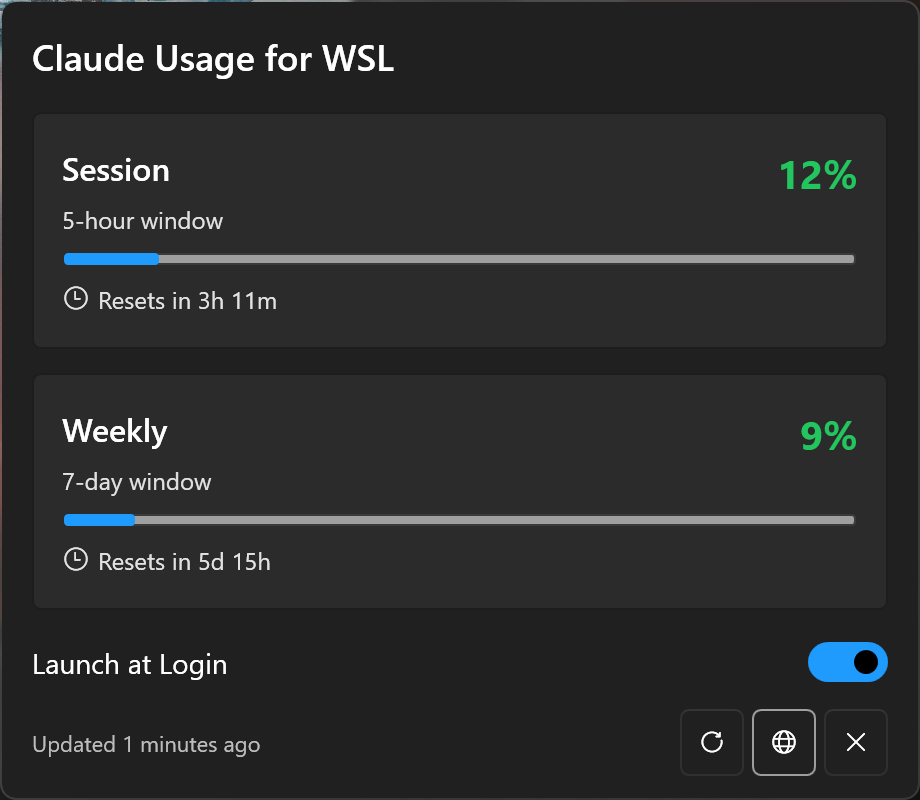

# Claude Usage for Windows and WSL

A Windows system tray application that displays Claude Code usage limits in real-time. Works with both Claude Code native for Windows and Claude Code running in WSL.

## Features

- **Dynamic tray icon** showing your current usage percentage (0-100%)
- **Color-coded status dot** - Green (0-69%), Yellow (70-89%), Red (90%+)
- **Theme-aware icons** - Adapts to Windows dark/light theme automatically
- **Special icons** - Unique icons for low usage, 95%, 99%, 100%, and error states
- **Fluent Design UI** matching Windows 11 style (Mica background, rounded corners)
- **Session usage** (5-hour window) with progress bar and reset countdown
- **Weekly usage** (7-day window) with progress bar and reset countdown
- **Sonnet Only usage** - Model-specific utilization with reset countdown
- **Overage tracking** - Extra usage spend vs. monthly limit
- **Auto-refresh** every 5 minutes
- **Retry with exponential backoff** on API errors (429/5xx, up to 5 retries)
- **Launch at Login** option
- **Smart credential auto-discovery** - Automatically detects credentials from Claude Code native for Windows or WSL distros (Debian, Ubuntu, etc.), picking the most recently used installation when both exist

## Requirements

- Windows 10/11
- [Claude Code CLI](https://claude.ai/code) installed and authenticated (native Windows or WSL)
- .NET 8.0 Runtime

## Installation

### Option 1: Download Release
Download the latest `ClaudeUsage.exe` from the [Releases](https://github.com/sr-kai/claudeusagewin/releases) page.

### Option 2: Build from Source
1. Clone this repository
2. Open `visualstudio-project/ClaudeUsage/ClaudeUsage.sln` in Visual Studio 2022
3. Restore NuGet packages
4. Build in Release mode
5. Publish as single-file: `dotnet publish -c Release -r win-x64 --self-contained false /p:PublishSingleFile=true`

## Usage

1. Make sure you've authenticated with Claude Code CLI (`claude` command) — either native Windows or in WSL
2. Run `ClaudeUsage.exe` on Windows
3. The app runs in system tray - look for the usage percentage icon
4. **Left-click** the tray icon to see detailed usage popup
5. **Right-click** for quick actions (Refresh, Launch at Login, Exit)

## How It Works

The app automatically discovers your Claude Code OAuth credentials by searching (in order):

1. **Windows native**: `%USERPROFILE%\.claude\.credentials.json`
2. **WSL distros**: `\\wsl$\{distro}\home\{user}\.claude\.credentials.json` (Debian, Ubuntu, etc.)

If credentials are found in both locations, the most recently modified file is used — so it automatically follows whichever Claude Code installation you're actively using. WSL paths are skipped with a 3-second timeout if WSL isn't running, so native-only users experience no delay.

The app sends requests with the required `claude-code/*` User-Agent header (auto-detecting your installed version) and retries automatically on rate limits or server errors.

> **Note:** This uses an undocumented API that could change at any time.

## Tech Stack

- C# / .NET 8
- WPF with [WPF-UI](https://github.com/lepoco/wpfui) for Fluent Design
- [Svg.NET](https://github.com/svg-net/SVG) for dynamic icon rendering
- System.Windows.Forms.NotifyIcon for tray integration

## License

MIT

## Credits

- Original macOS app by [richhickson](https://github.com/richhickson/claudecodeusage)
